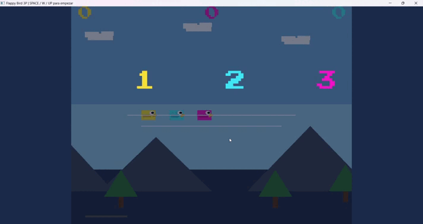

# Flappy Bird — OpenGL 2D (Java + LWJGL)


[⬇️ Descargar archivo .jar (Ejecutable)](bin/FlappyBird.jar?raw=true)



*Gameplay mostrando el modo de 2 jugadores simultáneos y el escalado de dificultad.*

## Descripción

Juego 2D estilo Flappy Bird construido con Java 17 y LWJGL 3.3.3 sobre OpenGL 3.3 core profile. El proyecto emplea un quad base reutilizable con uniforms de transformación para renderizar todos los elementos en pantalla, prescindiendo del uso de motores gráficos externos o funciones del pipeline fijo. El renderizado y el manejo de transformaciones de los elementos se realiza mediante operaciones matriciales directamente en CPU para ser inyectadas en los shaders.

## Características

- Pájaro compuesto por figuras geométricas (cuerpo, pico, cola, ojo con pupila, ala animada oscilando con `sin(t)`).
- Inclinación del pájaro proporcional a la velocidad vertical para mayor dinamismo.
- Modo un jugador y modo dos jugadores simultáneos en la misma ventana, con controles independientes.
- Dificultad progresiva: la velocidad de las tuberías y la frecuencia de aparición aumentan por nivel (Nivel 0: base, Nivel 1: medio, Nivel 2: avanzado, Nivel 3: máximo/techo).
- Menú principal con selección interactiva de modo de juego.
- Pantalla de Game Over con puntuaciones individuales y declaración clara del ganador o empate.
- HUD superior con el puntaje en tiempo real de cada jugador.
- Fondo completo con degradado armónico, suelo interactivo y elementos decorativos dibujados con primitivas puras de OpenGL.
- Tuberías renderizadas con capitel decorativo.
- Escalado dinámico de ventana responsivo mediante técnica de letterbox/pillarbox para asegurar que el aspect ratio se mantenga en todo momento.
- Detección precisa de colisiones mediante cajas delimitadoras AABB (Axis-Aligned Bounding Box).
- Audio inmersivo de salto, punto conseguido y estado de game over utilizando `javax.sound.sampled`.
- Sistema tipográfico robusto para renderizado de texto escalable y centrado automáticamente en menús.

## Requisitos del sistema

- Java 17 o superior.
- Maven 3.8+ (necesario para resolución de dependencias y compilación).
- GPU con soporte para OpenGL 3.3 (cualquier GPU de la última década).
- Sistema Operativo: Windows 10 / Windows 11 x64 (debido a los binarios nativos especificados en el pom.xml).

## Instalación y ejecución

### Opción 1: Cómo jugar rápido

Si descargaste el archivo `.jar` desde el enlace superior:

1. Asegúrate de tener instalado Java 17.
2. Abre una terminal en la carpeta donde descargaste el archivo y ejecuta:

   ```bash
   java -jar FlappyBird.jar
    ```

### Opción 2: Compilar desde el código fuente

```bash
# Clonar el repositorio
git clone https://github.com/moises-cisneros/Flappy-Bird
cd Flappy-Bird

# Compilar
mvn compile

# Ejecutar
mvn exec:java

# Opcional: compilar y empaquetar en un JAR independiente
mvn package 
java -jar target/FlappyBird-1.0-SNAPSHOT.jar

```

## Controles

| Jugador / Contexto | Acción | Tecla |
| --- | --- | --- |
| **Jugador 1** | Saltar | `SPACE` |
| **Jugador 2** | Saltar | `W` / `↑` |
| **Menú Principal** | Navegar Arriba | `↑` |
| **Menú Principal** | Navegar Abajo | `↓` |
| **Menú Principal** | Modo 1 Jugador Directo | `1` |
| **Menú Principal** | Modo 2 Jugadores Directo | `2` |
| **Menú Principal** | Confirmar Selección | `ENTER` / `SPACE` |
| **Game Over** | Volver a Intentar (Retry) | `R` / `SPACE` |
| **Game Over** | Menú Principal | `M` / `ESC` |

## Estructura del proyecto

```text
src/main/java/org/moises/
├── App.java                    ← Punto de entrada que inicializa y arranca la aplicación
├── core/
│   ├── Game.java               ← Bucle principal, control del viewport y máquina de estados
│   ├── GameState.java          ← Enumerador para los estados MAIN_MENU, PLAYING y GAME_OVER
│   └── InputManager.java       ← Polling nativo de GLFW y detección de flancos para teclas
├── entity/
│   ├── Bird.java               ← Datos anatómicos, física y renderizado compuesto de cada pájaro
│   └── Pipe.java               ← Estructura de tuberías y hitboxes AABB
├── render/
│   ├── Renderer.java           ← Abstracción para drawRect, drawTriangle y transformaciones matriciales
│   ├── BackgroundRenderer.java   ← Dibuja el fondo multicapa con primitivas y parallax
│   └── TextRenderer.java       ← Lógica de medición, escalado y dibujo geométrico de tipografía
├── ui/
│   ├── MainMenu.java           ← Dibujado y control de la pantalla de inicio
│   ├── GameOverMenu.java       ← Dibujado de resultados y botones de reintento
│   └── MenuAction.java         ← Enumerador para selección en menús (SELECT_1P, SELECT_2P, NONE)
└── audio/
    └── SoundManager.java       ← Sistema de Object Pooling y playback de pistas WAV

```

## Créditos y Recursos

- **Desarrollo y Arquitectura:** Moises Cisneros - [GitHub](https://github.com/moises-cisneros) | [X (Twitter)](https://x.com/cisn3ronauta)
- **Motor Gráfico y Binding:** Construido sobre [LWJGL 3](https://www.lwjgl.org/) (Licencia BSD).
- **Tipografía:** [Press Start 2P](https://fonts.google.com/specimen/Press+Start+2P) por CodeMan38 (SIL Open Font License).
- **Audio:** Efectos de sonido generados vía [jsfxr](https://sfxr.me) y/o biblioteca Kenney (CC0 Público).
- **Texture:** Imagen de explosión obtenida del pack [Kenney Particle Pack](https://kenney.nl/assets/particle-pack), bajo licencia (CC0 Público).

## Licencia

Este proyecto se distribuye bajo la licencia **MIT**. Eres libre de utilizar, modificar y distribuir este código para fines personales o educativos. Consulta el archivo `LICENSE` para más detalles.
